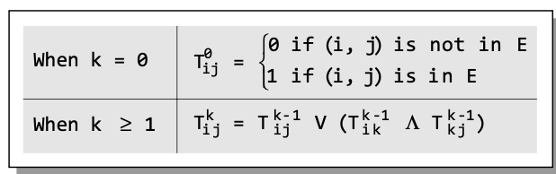

# Chapter 13 Notes

## Introduction:
- Graph: abstract data structure 
    - Used to implement the math concept of graphs
    - Collection of vertices and edges that connect to the vertices
- Graphs are used to model entities or things related to each other in pairs
- Definition: An ordered set $( V, E)$, where $V(G)$ represents the set of vertices and $E(G)$ represents the edges that connect to these vertices.
- Graph can be directed or undirected.
    - Undirected: edges do not have any direction associated with them
    - Directed: edges form an ordered pair

## Terminology
- Adjacent Nodes or Neighbors: for every edge, $e = (u, v) that connects nodes to $u$ and $v$, the nodes $u$ and $v$ are end-points and are said to be the adjacent nodes or neighbors
- Degree of a Node: the total number of edges containing a node
    - If the degree is 0, that means that the node does not belong to any edge and the node is considered isolated
- Regular Graph: A graph where each vertex has the same number of neighbors aka every node has the same degree
- Path: A path of length $n$ from a node to node is defined as a sequence of $(n+1)$ nodes
- Closed Path: A path where an edge has the same endpoints - $v_0 = v_n$
- Simple Path: a path where all the nodes in the path are distinct with an exception that $v_0$ may be equal to $v_n$
- Cycle: A path where the first and last vertices are the same
    - no repeated edges or vertices except the first and last
- Connected Graph: A graph where any two vertices $(u, v)$ in $v$ there is a path from $u$ to $v$
    - No isolated nodes
    - If it doesn't have a cycle then it is called a tree
- Complete Graph: A graph where all nodes are fully connected
    - Has $n(n-1)/2$ edges
- Clique: In an undirected graph $G = (V, E)$, clique is a subset of the vertex set $C \subseteq V$, such that for every two vertices in $C$, there is an edge that connects two vertices
- Labelled Graph of Weighted Graph: A graph where every edge in the graph is assigned some data
    - Weight of an edge is denoted by $w(e)$ is a positive value which indicates the cost of traversing the edge
- Multiple Edges: Distinct edges which connect the same end-points are called multiple edges
- Loop: an edge that has identical endpoints
- Multi-Graph: A graph with multiple edges and/or loops
- Size of a Graph: The size is the total number of edges in it

## Directed Graphs
- A directed graph is a graph where every edge has a direction assigned to it
    - aka: digraph
- Begins at $u$ - initial point and predecessor of $v$
- Terminates at $v$ - termination point and successor of $u$
- Nodes $u$ and $v$ are adjacent to each other

### Terminology of a Directed Graph:
- Out-degree of a node: The number of edges that originate at $u$
    - Denoted: $outdeg(u)$
- In-degree of a node: The number of edges that terminate at $u$
    - Denoted: $indeg(u)$
- Degree of a node: Is equal to the sum of in-degrees and out-degrees of that node
    - Denoted: $deg(u)$ or $deg(u) = indeg(u) + outdeg(u)$
- Isolated vertex: A vertex with degree 0
    - The vertex is not an end-point for any edge
- Pendant vertex: A vertex with degree 1
    - Also known as a leaf vertex
- Cut Vertex: A vertex when deleted would disconnect the remaining graph
- Source: A node that has a positive out-degree but a zero in-degree
- Sink: A node that has a positive in-degree but a zero out-degree
- Reachability: A node $v$ is said to be reachable from node $u$ if and only if there is a directed path from node $u$ to node $v$
- Strongly connected directed graph: A digraph where there exists a path between every pair of nodes
    - Path from $u$ to $v$ then there must be a path from $v$ to $u$
- Unilaterally connected graph: When there is a path between any pair ofnodes $u, v$ in the graph such that there is a path from $u, v$ and $v, u$ but not both
- Weakly connected digraph: If it is connected by ignoring the direction of edges
    - Must have an out-degree or in-degree of at least 1
- Parallel/Multiple edges: Distinct edges which connect the same end-points
- Simple directed graph: A graph with no parallel edges but can contain cycles with an exception that it cannot have more than one loop at a given node

### Transitive Closure of a Directed Graph
- Constructed to answer reachability questions, for example being able to determine whether node $E$ is reachable from node $A$
- Definition: For a directed graph $G = (V, E)$, where $V$ is the set of vertices and $E$ is the set of edges, the transitive closure of $G$ is a graph $G^* = (V, E^*)$
- Why it is needed:
    - Transitive closure is used to find the reachability analysis of transition networks representing distributed and parallel systems
    - It is used in the construction of parsing automata in compiler construction
    - Used to evaluate recursive database queries 
- Algorithm:
